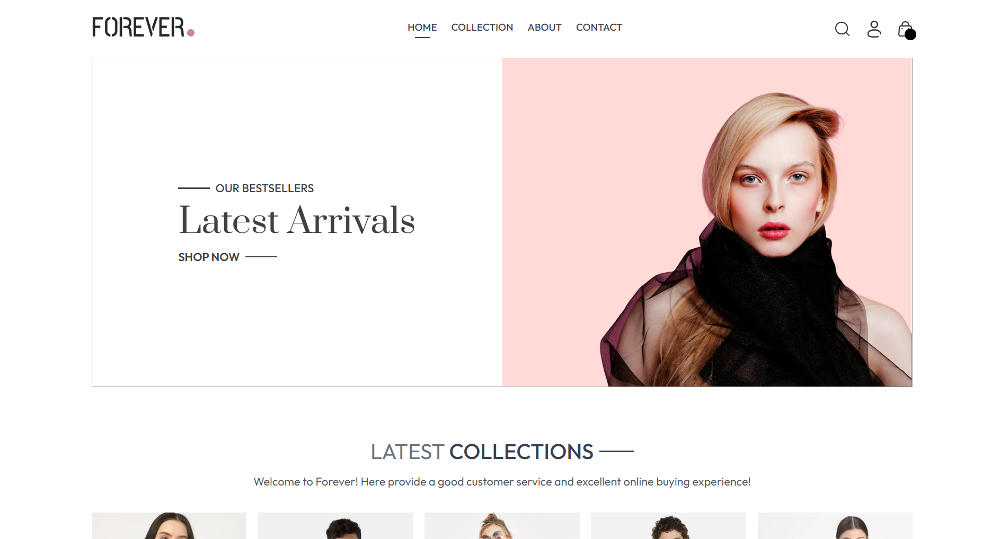
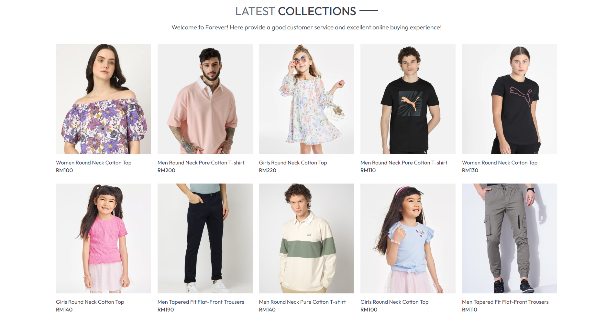
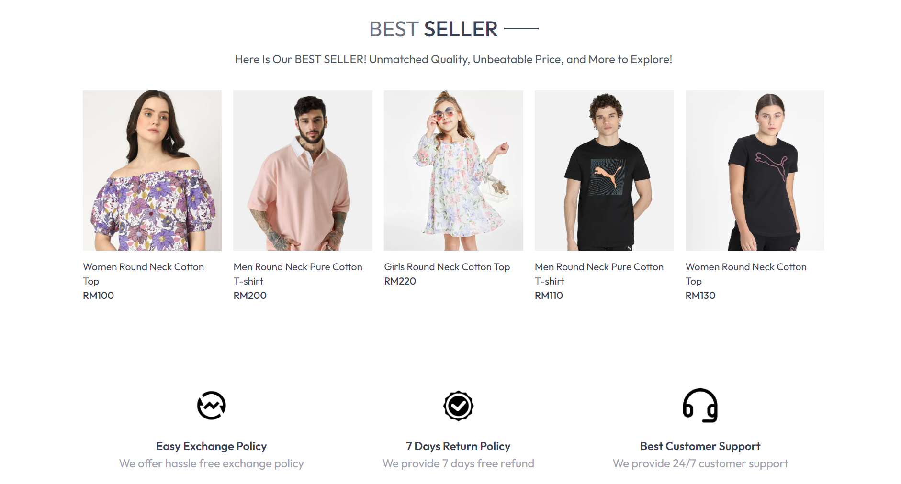
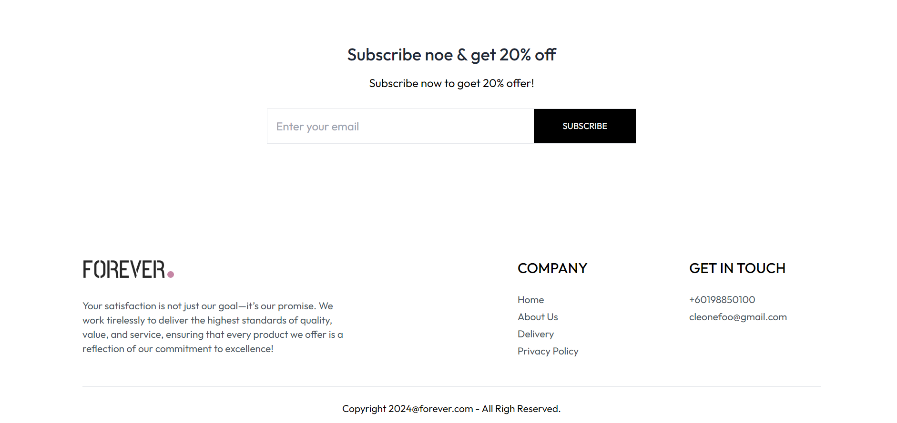

# E-Commerce Website

This project is a responsive web application that utilizes **React.js** for the front end, along with **Tailwind CSS** for styling. It features components such as a **Product Gallery**, **Shopping Cart**, and **Checkout Process**, each designed to provide a seamless user experience.

## Here is a preview of the website design:

## Technologies Used

-  **React.js**: The core JavaScript library used for building the user interface.
-  **Tailwind CSS**: A utility-first CSS framework used for efficient and responsive styling.
-  **JavaScript (ES6)**: Used for managing states, rendering components, and controlling dynamic behavior like the product filtering system.

## Contact Me

If you have any questions or would like to collaborate, feel free to connect with me via email at [cleonefoo@gmail.com](mailto:cleonefoo@gmail.com).
